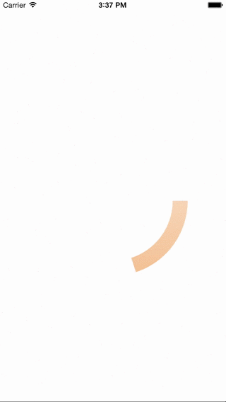
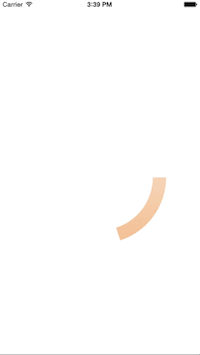

# BLCircularProgress

##Overview

**BLCircularProgress** is a customizable circular progress with built-in interactive functionality. It based on [PICircularProgressView](https://github.com/DerPipo/PICircularProgressView) but provides more flexible properties with controllable interface.

**BLCircularProgress** allows user to update progress natively via touching. And there are (3 * 7 + 1) animation approaches can be chosen to update current progress.

Swift Version: [BLCircularProgress-Swift](https://github.com/boylee1111/BLCircularProgress-Swift)

##Properties

```objective-c
@property (nonatomic) CGFloat maxProgress UI_APPEARANCE_SELECTOR; // Max value of progress
@property (nonatomic) CGFloat minProgress UI_APPEARANCE_SELECTOR; // Min value of progress
@property (nonatomic) CGFloat maximaProgress UI_APPEARANCE_SELECTOR; // Maxima value of progress, smaller than or equal to maxProgress
@property (nonatomic) CGFloat minimaProgress UI_APPEARANCE_SELECTOR; // Minima value of progress, larger than or equal to minProgress
```

```objective-c
@property (nonatomic) NSInteger clockwise UI_APPEARANCE_SELECTOR; // Whether cloackwise
```

`UI_APPEARANCE_SELECTOR` doesn't support `BOOL` before iOS 8

```objective-c
@property (nonatomic) CGFloat startAngle UI_APPEARANCE_SELECTOR; // Start angle value, will be flipped as angle larger than or equal to 0, smaller than 360
```

```objective-c
@property (nonatomic) CGFloat thicknessRadio UI_APPEARANCE_SELECTOR; // Represent the scale percentage of circle width and radius, e.g. radius * thicknessRadio = circle width
```

```objective-c
@property (nonatomic) CGFloat progressAnimationDuration UI_APPEARANCE_SELECTOR; // Duration while update progress with animation
```

```objective-c
@property (nonatomic) AnimationAlgorithm animationAlgorithm UI_APPEARANCE_SELECTOR; // Different calculation algorithm animation
```

Seven options for animation approaches as below:

```objective-c
typedef NS_ENUM(NSInteger, AnimationAlgorithm) {
    AnimationAlgorithmSimpleLine,
    AnimationAlgorithmQuadratic,
    AnimationAlgorithmCubic,
    AnimationAlgorithmQuartic,
    AnimationAlgorithmQuintic,
    AnimationAlgorithmSinusoidal,
    AnimationAlgorithmExponential,
    AnimationAlgorithmCircular
};
```

```objective-c
@property (nonatomic) AnimationType animationType UI_APPEARANCE_SELECTOR; // Different animation type, ease in, ease out, and both
```

Three different animation type as below:

```objective-c
typedef NS_ENUM(NSInteger, AnimationType) {
    AnimationTypeEaseIn,
    AnimationTypeEaseOut,
    AnimationTypeEaseInEaseOut
};
```

The three options are the same for `AnimationAlgorithmSimpleLine` approaches.

```objective-c
@property (nonatomic) CGFloat touchResponseOuterShiftValue UI_APPEARANCE_SELECTOR; // Extend touching response scale from circle outer border
@property (nonatomic) CGFloat touchResponseInnerShiftValue UI_APPEARANCE_SELECTOR; // Extend touching response scale from circle inner border
```

```objective-c
@property (nonatomic, strong) UIColor *progressFillColor UI_APPEARANCE_SELECTOR;
@property (nonatomic, strong) UIColor *progressTopGradientColor UI_APPEARANCE_SELECTOR;
@property (nonatomic, strong) UIColor *progressBottomGradientColor UI_APPEARANCE_SELECTOR;
```


##Method

```objective-c
- (void)animateProgress:(CGFloat)newProgress completion:(void (^)(CGFloat))completion;
```

Build-in update progress with animation, `completion` is the callback.

##Delegate

###Touching Delegates

```objective-c
- (void)circularProgressView:(BLCircularProgressView *)circularProgressView didBeganTouchesWithProgress:(CGFloat)progress;
- (void)circularProgressView:(BLCircularProgressView *)circularProgressView didMovedTouchesWithProgress:(CGFloat)progress;
- (void)circularProgressView:(BLCircularProgressView *)circularProgressView didEndedTouchesWithProgress:(CGFloat)progress;
- (void)circularProgressView:(BLCircularProgressView *)circularProgressView didCancelledTouchesWithProgress:(CGFloat)progress;
```

These 4 delegates provide the interface while user update progress via touching. They are corresponding to the touches event respectively as belows:

```objective-c
- (void)touchesBegan:(NSSet *)touches withEvent:(UIEvent *)event
- (void)touchesMoved:(NSSet *)touches withEvent:(UIEvent *)event
- (void)touchesEnded:(NSSet *)touches withEvent:(UIEvent *)event
- (void)touchesCancelled:(NSSet *)touches withEvent:(UIEvent *)event
```

###Animation Delegates

```objective-c
- (void)circularProgressView:(BLCircularProgressView *)circularProgressView didDuringAnimationWithProgress:(CGFloat)progress;
- (void)circularProgressView:(BLCircularProgressView *)circularProgressView didBeganAnimationWithProgress:(CGFloat)progress;
- (void)circularProgressView:(BLCircularProgressView *)circularProgressView didEndedAnimationWithProgress:(CGFloat)progress;
```

The 3 delegates are fired while `animateProgress:completion:` is invoked. They are corresponding the *before animation*, *animating*, *after animation* respectively.


##Animation Preview

**Note: From left to right are EaseInEaseOut, EaseIn, and EaseOut except Simple Linear**

###Simple Linear


###Quadratic


###Cubic


###Quartic


###Quintic





###Sinusoidal


###Exponential


###Circular





##Credits

- [PICircularProgressView](https://github.com/DerPipo/PICircularProgressView)
- [Robert Penner](https://www.linkedin.com/in/robertpenner)

##License

BLCircularProgress is available under the MIT license. See the LICENSE file for more info.
